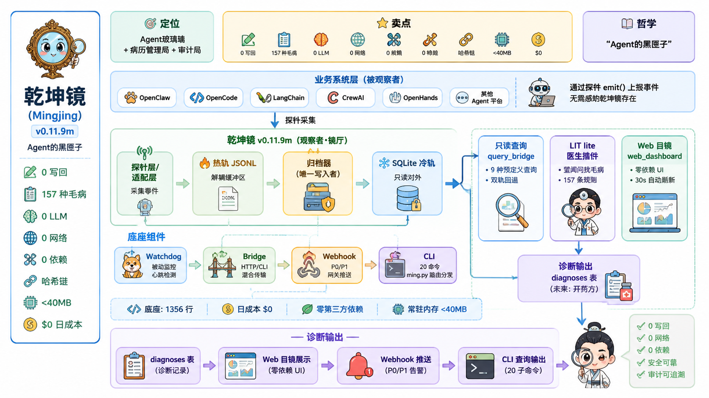
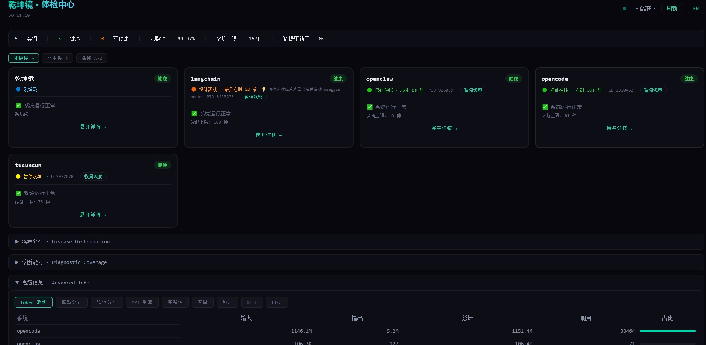
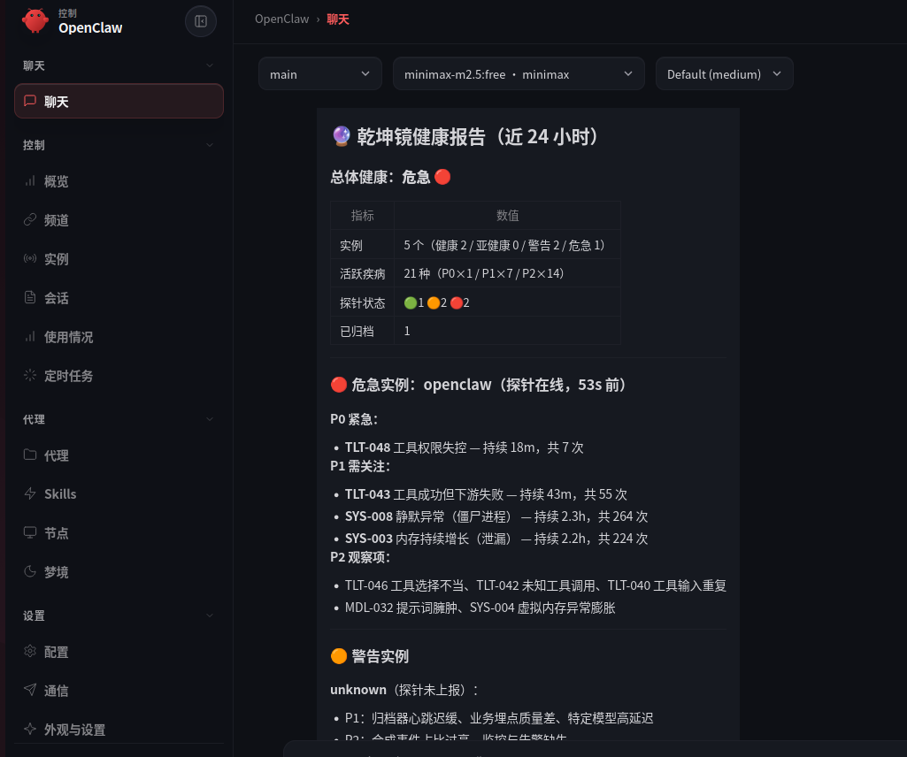

# 乾坤镜 Mingjing

> **仓库** `Ming_qiankun` · **PyPI** `mingjing` · **CLI** `ming`
>
> **AI Agent 观测阵列 · 档案管理局 · 诊断引擎** — 全量记录 Agent 平台的 LLM 调用、工具执行、记忆检索与编排行为，支持可扩展的插件化诊断（标配诊断插件 LIT lite 目前支持 157 种病症规则）。
>
> [🌏 English](./README_en.md) | [📖 完整手册](updocs/)

[](https://pypi.org/project/mingjing/)
[](https://www.python.org/downloads/)
[](LICENSE)
[]()

[]()
[]()
[]()
[]()
[](https://github.com/wulun811/Ming_qiankun/pulls)

[]()
[]()
[]()
[]()
[]()
[]()
[](https://artificialintelligenceact.eu/article/12/)

> **许可声明**：乾坤镜采用 **Business Source License 1.1**。年收入 <$100K 的公司和个人免费商用，非商用无限制。**2030-12-31 自动转换为 Apache 2.0**。

**乾坤镜是 LIT 1.4 的轻量折射阵列，也是 Agent 行为的档案管理局。** 它通过热轨 JSONL 文件 + SQLite/MySQL 持久层，为 OpenClaw、Hermes、LangChain 等 Agent 框架提供全量行为记录与可扩展的插件化诊断（LlamaIndex、CrewAI、OpenHands、AutoGPT 适配器 Coming Soon）。






---

## 为什么选乾坤镜？

乾坤镜是 Agent 行为的档案管理局：探针全量记录 LLM 调用、工具执行、记忆检索与编排行为，哈希链防篡改，本地零依赖。标配诊断插件 LIT lite 内置 157 种病症规则，插件化架构支持扩展至更多。**Standalone 模式：0 LLM 调用 · 0 写回 · 0 联网，数据不离机。**

### 按场景选择

| 你的场景 | 推荐方案 |
|----------|----------|
| 我要 SaaS 免运维 | LangSmith / Langfuse（云端托管） |
| 我要本地零依赖 + 语义诊断 | **乾坤镜**（`pip install` → 即用） |
| 我要接入现有 Prometheus/Grafana | OpenTelemetry + 自建 |
| 我要 LLM 可观测 + 数据分析 | Phoenix（Arize） |

### 乾坤镜的差异化

| 维度 | **乾坤镜** | LangSmith | Langfuse | Phoenix | OpenTelemetry |
|------|-----------|-----------|----------|---------|---------------|
| **定位** | 观测阵列 + 档案管理局 + 诊断引擎 | 可观测性 SaaS | 可观测性 SaaS | LLM 可观测 | 协议标准 |
| **第三方依赖** | **0** | 需 SDK + API Key | 需 SDK + API Key | 需 SDK + 后端 | OTel SDK + Collector |
| **LLM API 调用** | **0** | 需要 | 需要 | 不需要 | 不需要 |
| **事件保留** | 本地全量记录 + 哈希链 | 云端存储 | 云端存储 | 本地可选 | 自控 |
| **诊断能力** | 插件化（标配 LIT lite，157 → N） | 固定功能 | 固定功能 | 固定功能 | ❌ 无 |
| **离线可用** | **✅** | ❌ | ❌ | ✅ | ✅ |
| **安装成本** | `pip install` | 注册 + SDK | 注册 + SDK | `pip install` + 后端 | 安装 Collector |
| **数据隐私** | **数据不离机** | 上传云端 | 上传云端 | 本地可选 | 自控 |

> **定位**：不是要替代 LangSmith/Langfuse，而是为**纯本地部署**、**资源受限**、**需要语义诊断而非原始指标**的场景提供零依赖方案。
>
> 本地全量记录 + 哈希链完整性 + 可配置保留策略，天然支持 **EU AI Act Art. 12/19** 记录保留合规。

---

📖 完整手册：请参阅 [updocs/](updocs/) 目录下的完整文档。

## 5 分钟上手

### 1. 安装

```bash
# 方式一：PyPI 安装（推荐）
pip install mingjing

# 方式二：从源码克隆
git clone https://github.com/wulun811/Ming_qiankun.git
cd Ming_qiankun
```

### 2. 启动服务（零依赖）

> **为什么分两个入口？** `python3 -m src.ming start` 只启动归档器（~40MB RSS），`ming web serve` 额外启动 Web 面板（40MB~100MB，视页面内容）。资源受限场景可只开归档器，通过 CLI `ming dx` 查诊断，零前端开销。

```bash
# Standalone 模式 — 纯 Python 标准库，零第三方依赖
# 启动归档器守护进程（PyPI / 源码通用）：
python3 -m src.ming start

# 启动 Web 面板（可选）：
ming web serve
```

### 3. 发射测试事件

> **PyPI 安装用户**（无需 git clone）：
> 安装后直接使用，探针模块自动在包路径中。

```bash
# PyPI 用户：一行命令发射测试事件
python -m mingjing demo

# 源码用户：以下命令需在项目根目录执行
python -c "
import sys; sys.path.insert(0, 'src')
from probe_uni import ProbeUni
p = ProbeUni(system='demo', mode='white')
p.emit('llm_invoke', {
    'layer_agent': {'step_id': 'test', 'session_id': 's1', 'agent_name': 'demo'},
    'layer_llm': {'model': 'gpt-4', 'input_tokens': 100, 'output_tokens': 50, 'latency_ms': 230, 'cache_hit': False},
    'layer_network': {'target_host': 'api.openai.com', 'status_code': 200}
})
print('Event emitted!')
"
```

### 4. 查看诊断

```bash
# 查看当前系统诊断（无需启动 Web 面板）
ming dx list
```

### 5. 查看 Web 目镜

```bash
# 启动 Web 服务（自动导出 + 自动刷新，绑定 127.0.0.1:18088）
ming web serve

# 局域网访问
ming web serve --port 18088
# 浏览器打开 http://localhost:18088 或 http://<本机IP>:18088
```

**自动更新**：Web 服务内置每 30 秒自动导出 data.json + 前端自动刷新，无需手动执行 export 命令。

**局域网访问**：
| 场景 | 命令 | 浏览器地址 |
|------|------|-----------|
| 本机仅 | `ming web serve` | `http://localhost:18088` |
| 局域网开放 | `ming web serve --host 0.0.0.0 --port 18088 --no-browser` | `http://<本机IP>:18088` |
| 加认证 | `ming web serve --host 0.0.0.0 --port 18088 --no-browser --token your-secret` | `http://<本机IP>:18088/?token=your-secret` |

---

## Docker 一键运行

```bash
docker build -t ming .
docker run -d --name ming -p 18088:18088 ming
# 默认启动归档器 + Web 面板（总 RSS ~140MB）
# 打开 http://localhost:18088
```

---

## 架构概览

```
┌─────────────┐     JSONL hot files      ┌──────────────┐
│  Probes     │ ───────────────────────► │  Archiver    │
│  (无状态)    │                          │  (唯一写入者) │
└─────────────┘                          └──────┬───────┘
       │                                        │
       │  OpenClaw / Hermes                     │ SQLite / MySQL
       │  LangChain / LlamaIndex                ▼
       │  CrewAI / OpenHands / AutoGPT   ┌──────────────┐
       │                                 │  Query       │
       └────────────────────────────────►│  Bridge      │
                                         └──────┬───────┘
                                                │
                                          ┌─────▼─────┐
                                          │  Web UI   │
                                          └───────────┘
```

### 核心模块

| 模块 | 行数 | 职责 |
|------|------|------|
| `probe_uni.py` | ~340 | 无状态热轨写入器，零数据库依赖 |
| `archiver.py` | ~670 | 唯一写入者，顺序扫描 hot → SQLite |
| `cli.py` | ~380 | 命令行：dx/health/skill/query/status/web |
| `lit_lite.py` | ~240 | 诊断核心引擎 |

### 适配器（官方参考实现）

| 适配器 | 语言 | 事件类型 | 实现方式 |
|--------|------|----------|----------|
| **OpenClaw** | Node.js | llm_invoke, tool_call, error | Node.js 插件 |
| **OpenCode** | Python | llm_invoke, tool_call, error | DB 轮询包装器 |
| **Hermes** | Python | llm_invoke, tool_call, memory_retrieve | Hermes Skill |
| **LangChain** | Python | llm_invoke, tool_call, memory_retrieve | Pip 包 + monkey-patch |
| **LlamaIndex** | Python | llm_invoke, memory_retrieve, agent_step | Python 探针 |
| **CrewAI** | Python | agent_step, llm_invoke | Python 探针 |
| OpenHands | Python | agent_step, llm_invoke, tool_call | Coming Soon |
| AutoGPT | Python | agent_step, llm_invoke | Coming Soon |

> 标记"Coming Soon"的适配器代码已实现，正在集成测试中，欢迎提前试用并反馈。

### 适配器升级检查清单

升级宿主平台（OpenClaw / OpenCode / Hermes / LangChain）后，按以下步骤验证探针是否正常工作：

| 适配器 | 升级后操作 | 验证命令 |
|--------|-----------|---------|
| **OpenClaw** | 需手动重新注册插件 | `openclaw plugins install --link ~/.openclaw/extensions/mingjing-probe/index.js` |
| **Hermes** | **无需操作**（hooks 接口官方稳定） | `hermes plugins list && ls ~/.ming/hot/ \| head` |
| **OpenCode** | 检查 stderr 是否有 schema 警告 | 启动探针后检查 `~/.ming/hot/` 是否有新文件 |
| **LangChain** | 运行快速验证命令 | `python -c "import ming_probe_langchain; print('OK')"` |

所有适配器升级后均可通过 `python -m mingjing health` 检查归档器状态。



---

## 诊断能力（50 种典型病症示例）

标配诊断插件 LIT lite 内置 **157 种病症检测规则**（插件化架构支持扩展至更多），以下是 OpenClaw 运行时可自动诊断的 50 个典型示例：

### 系统层

| ID | 病症 | 级别 | 描述 |
|----|------|------|------|
| SYS-002 | 内存溢出（OOM） | P0 | 进程内存溢出，通常是内存不足或内存泄漏导致 |
| SYS-003 | 内存持续增长（泄漏） | P1 | RSS 近期均值显著高于早期均值（≥1.8x），疑似内存持续泄漏 |
| SYS-004 | 虚拟内存异常膨胀 | P2 | 虚拟内存远超物理内存（Node.js 阈值 30GB） |
| SYS-005 | 文件描述符泄漏 | P1 | 文件描述符数量持续增长，可能未正确关闭文件/连接 |
| SYS-006 | 线程爆炸 | P1 | 线程数异常增长，可能导致上下文切换开销暴增 |
| SYS-007 | 磁盘空间不足 | P1 | 磁盘剩余空间低于 500MB，可能导致日志写入失败 |
| SYS-008 | 静默异常（僵尸进程） | P1 | PID 存活但 10 分钟内无事件发出，可能已僵死 |
| SYS-013 | 归档器死亡 | P0 | 归档器心跳停止，事件无法持久化 |
| SYS-017 | CPU 负荷高 | P1 | 1 分钟负载超过 CPU 核心数的 80% |
| SYS-019 | CPU Load 异常飙升 | P1 | CPU 1 分钟 load 短时间暴增 3 倍以上，可能 CPU 风暴 |
| SYS-032 | Token 消耗突增 | P1 | 近 5 分钟 Token 消耗超过基准的 3 倍 |

### 网络层

| ID | 病症 | 级别 | 描述 |
|----|------|------|------|
| NET-017 | TCP 连接失败 | P0 | 网络不通或目标主机不可达 |
| NET-018 | DNS 解析失败 | P0 | 域名无法解析，可能是 DNS 服务器故障 |
| NET-020 | HTTP 5xx 服务端错误 | P1 | 目标服务频繁返回 5xx，服务可能不稳定 |
| NET-021 | 特定 Host 频繁失败 | P1 | 特定目标主机错误率超过 30% |
| NET-024 | 网络分区（非 LLM 延迟） | P1 | 网络层连接失败导致 LLM 无响应，非模型延迟 |
| NET-027 | 连接池耗尽 | P1 | 同一目标主机并发连接数过高，可能连接池耗尽 |
| NET-029 | LLM Rate Limit（限流） | P1 | LLM API 返回 429，触发速率限制 |
| NET-030 | LLM 认证失败 | P0 | API Key 过期或无权限，业务立即中断 |
| NET-031 | LLM 服务过载 | P1 | LLM API 返回 503，服务端过载/维护 |
| NET-032 | LLM 服务端内部错误 | P1 | LLM API 返回 500，模型推理异常或后端崩溃 |

### 模型层

| ID | 病症 | 级别 | 描述 |
|----|------|------|------|
| MDL-029 | LLM 输出被截断 | P2 | 输出因 token 限制被截断，可能需要增大 max_tokens |
| MDL-030 | LLM 内容被过滤 | P1 | 输出被内容过滤器拦截，可能触发安全策略 |
| MDL-031 | LLM 空返回 | P2 | 返回 200 但无输出内容，可能是提示词问题 |
| MDL-032 | 提示词臃肿 | P2 | 输入 token 远超输出，提示词可能过于冗长 |
| MDL-033 | 特定模型高延迟 | P1 | 特定模型响应延迟超过 5 秒 |
| MDL-036 | 推理成本失控 | P1 | Token 消耗超过阈值，检查循环调用或模型降级 |
| MDL-039 | LLM 空转（无工具调用） | P1 | LLM 多次调用但无工具调用跟进，可能存在推理循环 |
| MDL-040 | 模型 API 密钥未配置 | P0 | API 密钥未配置或已失效，LLM 调用将全部失败 |
| MDL-041 | 模型缓存命中率低 | P2 | 超过 90% 的 LLM 调用未命中缓存 |

### 工具层

| ID | 病症 | 级别 | 描述 |
|----|------|------|------|
| TLT-039 | 工具调用超时 | P1 | 工具调用超时，依赖服务可能不可用 |
| TLT-043 | 工具成功但下游失败 | P1 | 工具调用成功但后续发生错误，下游依赖问题 |
| TLT-044 | 工具权限不足 | P1 | 工具调用因权限不足失败 |
| TLT-046 | 工具选择不当 | P2 | 工具频繁失败（3次以上），可能选错工具或参数不当 |
| TLT-047 | 工具连续失败 | P1 | 同一工具 5 分钟内连续失败超过 3 次 |
| TLT-048 | 工具权限失控 | P0 | Agent 调用高危工具，需立即检查权限配置 |
| TLT-052 | 长时间无响应（思考停滞） | P1 | Agent 步骤开始后超过 2 分钟未完成 |
| TLT-058 | 危险工具调用 | P0 | Agent 调用高风险系统命令，可能造成不可逆影响 |
| TLT-060 | 工具输入循环重复 | P1 | 同 session 内相同参数出现 ≥ 5 次，存在调用循环 |

### Agent 层

| ID | 病症 | 级别 | 描述 |
|----|------|------|------|
| AGT-058 | 多 Agent 通信开销爆炸 | P1 | LLM 调用频次和 Token 消耗呈 O(N²) 增长 |
| AGT-062 | 错误传播与级联崩盘 | P0 | 同一错误类型频繁出现，可能引发级联崩盘 |
| AGT-063 | 开发失败恢复能力弱 | P0 | 同一错误类型重复出现且无修复事件 |
| AGT-067 | Agent 达到最大轮次 | P2 | Agent 达到最大推理轮次限制，任务被迫中止 |
| AGT-071 | Agent 组件错误高频 | P2 | 推理模块组件错误高频 ≥ 5 次，可能存在系统性问题 |

### 探针底座 & 数据质量

| ID | 病症 | 级别 | 描述 |
|----|------|------|------|
| PRB-078 | 探针持续丢包 | P1 | 探针持续丢包，可能缓冲区满或磁盘慢 |
| PRB-079 | 哈希链损坏 | P0 | 哈希链完整性校验失败，数据可能被篡改 |
| PRB-081 | 探针缓冲区积压 | P1 | 探针缓冲区持续增长，归档器可能消费慢 |
| PRB-082 | 探针自错误累积 | P2 | 探针自身错误频繁，可能影响数据质量 |
| DQT-086 | 异常类型频率暴增 | P1 | 同一错误类型 5 分钟内出现超过 10 次 |
| DQT-087 | 堆栈模式重复 | P2 | 相同堆栈跟踪频繁出现，可能是同一根因 |

> 标配诊断插件 LIT lite 的 **157 种病症定义** 见 [`config/diseases.yaml`](config/diseases.yaml)。通过 `ming dx list` 查看当前系统诊断结果。
>
> 当前规则内置在包中，需随版本更新。用户自定义规则引擎已在路线图中。

---

## 性能

| 场景 | 事件量 | 速率 | 归档率 | RSS 内存 |
|------|--------|------|--------|----------|
| 75s × 2000eps | 150K | 2000 events/s | **100%** | 38MB |
| 15min × 1000/s | 882K | 1000 events/s | 99.9% | 18MB |
| 3min × 5000/s | 884K | 5000 events/s | 100% | 18MB |

> *882K 测试中 0.1% 未归档是热轨缓存中的事件，在测试窗口关闭时尚末被扫描到，**非数据丢失**。归档器持续运行后全部落库。*

---

## 双模式

| 模式 | 环境变量 | 持久层 | 依赖 |
|------|----------|--------|------|
| **Standalone** | `MING_MODE=standalone`（默认） | SQLite | 纯标准库 |
| **Cluster** | `MING_MODE=cluster` | MySQL | pymysql |

```bash
# Standalone（默认）
python3 -m src.ming start

# Cluster
MING_MODE=cluster \
  WQ_DB_HOST=127.0.0.1 \
  WQ_DB_USER=root \
  WQ_DB_PASSWORD=secret \
  WQ_DB_NAME=ming \
  python3 -m src.ming start
```

---

## 性能调参

Standalone 模式下，归档器默认处理 **1000 事件/秒**。通过环境变量可灵活调整：

| 环境变量 | 默认值 | 说明 | 典型场景 |
|----------|--------|------|----------|
| `WQ_ARCHIVER_BATCH_SIZE` | `1000` | 每次扫描的热轨文件数上限 | 高密度写入：`5000` |
| `WQ_ARCHIVER_FLUSH_SEC` | `1.0` | 扫描间隔（秒） | 低延迟要求：`0.5` |
| `WQ_ARCHIVER_VACUUM_HOURS` | `24` | VACUUM 间隔（小时） | 磁盘紧张时：`6` |

### 场景推荐

```bash
# 场景 1: 默认（大多数用户，1000 events/s）
MING_MODE=standalone python3 -m src.ming start

# 场景 2: 高吞吐（写入密集，~5000 events/s）
WQ_ARCHIVER_BATCH_SIZE=5000 \
WQ_ARCHIVER_FLUSH_SEC=0.5 \
MING_MODE=standalone python3 -m src.ming start

# 场景 3: 省电模式（低负载设备，~200 events/s）
WQ_ARCHIVER_BATCH_SIZE=200 \
WQ_ARCHIVER_FLUSH_SEC=5.0 \
MING_MODE=standalone python3 -m src.ming start
```

> **提示**：调整参数后需重启归档器生效。前端 Config 面板可查看当前配置值（只读）。

---

## 运行测试

```bash
# 全量测试
python -m pytest tests/ -v

# 仅适配器 Mock 测试
python -m pytest tests/test_probe_*_mock.py -v
```

当前状态：**501 passed, 0 failed, 2 skipped**

---

## 代码量预算

> **核心底座 < 2,000 行** — 探针 + 归档器 + CLI + 查询，零第三方依赖。删除任一则写流水线失效。

以下为可选扩展，按需加载，配置见 [`config/budget.json`](config/budget.json)：

| 分类 | 预算 | 说明 |
|------|------|------|
| 核心底座 | < 2,000 行 | 不可拆卸的最小核心 |
| cluster_extension | ≤ 600 行 | Cluster 模式（可选，仅需 pymysql） |
| plugin_layer | 无上限 | 插件越多生态越强 |
| adapter_layer | 无上限 | 每新增一个框架即新增一个生态节点 |
| test_layer | 无上限 | 测试代码单独统计 |

---

## 目录结构

```
├── src/                    # 源代码
│   ├── ming.py       # 统一入口
│   ├── probe_uni.py        # 探针
│   ├── archiver.py         # 归档器
│   ├── cli.py              # CLI
│   ├── adapters/           # 适配器
│   └── plugins/            # 插件
├── tests/                  # 测试
├── config/                 # 配置
│   └── budget.json         # 代码量预算
├── updocs/                 # 文档（架构+探针+诊断+数据+接口+运维+测试）
└── .github/workflows/      # CI/CD
```

---

## 贡献

见 [CONTRIBUTING.md](CONTRIBUTING.md)。

### 铁律（违反即 P0）

- **Standalone 零第三方依赖**：仅 Python 标准库
- **Cluster 唯一额外依赖**：仅 `pymysql`
- **探针纯粹**：`probe_uni.py` 不 import sqlite3/pymysql
- **唯一写入者**：只有归档器可写入持久层
- **只读对外**：查询模块使用只读连接

---

## 许可

Business Source License 1.1 — 年收入 <$100K 的公司和个人免费商用，非商用无限制。**2030-12-31 自动转换为 Apache 2.0**。详见 [LICENSE](LICENSE) 文件。

---

## 作者

- **陈正 (Chenzheng)** · [@wulun811](https://github.com/wulun811)
- 官方邮箱：zhulong007ai@163.com
- 灵感始于：**诛仙协议 / THEOCLAST Protocol (TCL)**

---

**乾坤镜 v0.11.13 — 为社区而生。**

---

> ⚠️ **测试阶段声明**：乾坤镜目前处于活跃开发阶段（版本 0.x），尚未发布 1.0 正式版。
> 软件按"现状"提供，不附带任何明示或暗示的担保。使用者应自行承担风险。
> 生产环境使用前请充分测试。详见 [LICENSE](LICENSE)。
