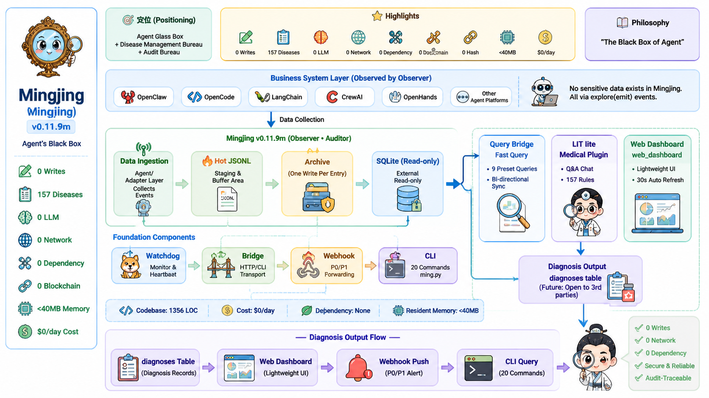

# Mingjing

> **Repo** `Ming_qiankun` · **PyPI** `mingjing` · **CLI** `ming`
>
> **AI Agent Observation Array · Archives Administration · Diagnostic Engine** — Full-fidelity recording of Agent platform behaviors (LLM calls, tool execution, memory retrieval, orchestration), with extensible pluggable diagnostics (built-in diagnostic plugin LIT lite currently supports 157 disease rules).
>
> [🌏 中文](./README.md) | [📖 Full Docs](updocs/)

[](https://pypi.org/project/mingjing/)
[](https://www.python.org/downloads/)
[](LICENSE)
[]()

[]()
[]()
[]()
[]()
[](https://github.com/wulun811/Ming_qiankun/pulls)

[]()
[]()
[]()
[]()
[](https://artificialintelligenceact.eu/article/12/)

> **License**: Mingjing uses **Business Source License 1.1**. Free production use for companies/individuals with annual revenue < $100K. Non-production use unrestricted. **Automatically converts to Apache 2.0 on 2030-12-31**.

**Mingjing is LIT 1.4's lightweight refraction array and an Archives Administration for Agent behaviors.** It provides full-fidelity behavior recording and extensible pluggable diagnostics for OpenClaw, Hermes, LangChain, and other Agent frameworks via hot-rail JSONL files + SQLite/MySQL persistence layer (LlamaIndex, CrewAI, OpenHands, AutoGPT adapters — Coming Soon).





---

## Why Mingjing?

Mingjing is the Archives Administration for Agent behaviors: probes record every LLM call, tool execution, memory retrieval, and orchestration action with hash-chain tamper-proof integrity, fully local with zero dependencies. The built-in diagnostic plugin LIT lite includes 157 disease rules, with a pluggable architecture that supports extension to many more. **Standalone mode: 0 LLM calls · 0 writeback · 0 network — data never leaves your machine.**

### When to choose what

| Your scenario | Recommended |
|---------------|-------------|
| I want SaaS, zero ops | LangSmith / Langfuse (cloud-hosted) |
| I want local zero-dependency + semantic diagnosis | **Mingjing** (`pip install` → ready) |
| I want to plug into Prometheus/Grafana | OpenTelemetry + DIY |
| I want LLM observability + data analysis | Phoenix (Arize) |

### Mingjing's differentiation

| Aspect | **Mingjing** | LangSmith | Langfuse | Phoenix | OpenTelemetry |
|--------|------------|-----------|----------|---------|---------------|
| **Positioning** | Observation Array + Archives + Diagnostic Engine | Observability SaaS | Observability SaaS | LLM Observability | Protocol Standard |
| **Dependencies** | **0** | SDK + API Key | SDK + API Key | SDK + backend | OTel SDK + Collector |
| **LLM API calls** | **0** | Yes | Yes | No | No |
| **Event retention** | Local full-fidelity + hash chain | Cloud storage | Cloud storage | Self-host option | Self-managed |
| **Diagnostics** | Pluggable (LIT lite built-in, 157 → N) | Fixed | Fixed | Fixed | ❌ None |
| **Offline** | **✅** | ❌ | ❌ | ✅ | ✅ |
| **Setup** | `pip install` | Register + SDK | Register + SDK | `pip install` + backend | Collector setup |
| **Data privacy** | **Never leaves host** | Uploads to cloud | Uploads to cloud | Self-host option | Self-managed |

> **Positioning**: Not a replacement for LangSmith/Langfuse, but a zero-dependency alternative for **fully local deployment**, **resource-constrained environments**, and **semantic diagnosis** over raw metrics.
>
> Local full-fidelity recording + hash-chain integrity + configurable retention policy — naturally supports **EU AI Act Art. 12/19** record-keeping compliance.

---

📖 Full documentation: see [updocs/](updocs/) directory.

## 5-Minute Quick Start

### 1. Install

```bash
# Option A: PyPI (recommended)
pip install mingjing

# Option B: Clone from source
git clone https://github.com/wulun811/Ming_qiankun.git
cd Ming_qiankun
```

### 2. Start services (zero dependencies)

> Why two entry points?
> `python3 -m src.ming start` starts only the archiver (~40MB RSS).
> `ming web serve` additionally starts the Web dashboard (40MB~100MB, depending on page content).
> In resource-constrained scenarios, run archiver only and use `ming dx` for diagnostics — zero frontend overhead.

```bash
# Standalone mode — pure Python stdlib, zero third-party dependencies
# Start the archiver daemon (PyPI / source both work):
python3 -m src.ming start

# Start Web dashboard (optional):
ming web serve
```

### 3. Emit a test event

> **PyPI users** (no git clone needed): probe module is auto-included in the package.

```bash
# PyPI users: one-liner to emit a test event
python -m mingjing demo

# Source users: run from project root
python -c "
import sys; sys.path.insert(0, 'src')
from probe_uni import ProbeUni
p = ProbeUni(system='demo', mode='white')
p.emit('llm_invoke', {
    'layer_agent': {'step_id': 'test', 'session_id': 's1', 'agent_name': 'demo'},
    'layer_llm': {'model': 'gpt-4', 'input_tokens': 100, 'output_tokens': 50, 'latency_ms': 230, 'cache_hit': False},
    'layer_network': {'target_host': 'api.openai.com', 'status_code': 200}
})
print('Event emitted!')
"
```

### 4. View diagnostics

```bash
# View current system diagnostics (no Web dashboard needed)
ming dx list
```

### 5. Open Web Dashboard

```bash
# Start Web service (auto-export + auto-refresh, binds 127.0.0.1:18088)
ming web serve

# LAN access
ming web serve --port 18088
# Open http://localhost:18088 or http://<your-IP>:18088
```

**Auto-update**: Web service has built-in 30s auto-export data.json + frontend auto-refresh.

**LAN access**:
| Scenario | Command | Browser URL |
|----------|---------|-------------|
| Local only | `ming web serve` | `http://localhost:18088` |
| LAN open | `ming web serve --host 0.0.0.0 --port 18088 --no-browser` | `http://<your-IP>:18088` |
| With auth | `ming web serve --host 0.0.0.0 --port 18088 --no-browser --token your-secret` | `http://<your-IP>:18088/?token=your-secret` |

---

## Docker Quick Run

```bash
docker build -t ming .
docker run -d --name ming -p 18088:18088 ming
# Default: archiver + Web dashboard (total RSS ~140MB)
# Open http://localhost:18088
```

---

## Architecture Overview

```
┌─────────────┐     JSONL hot files      ┌──────────────┐
│  Probes     │ ───────────────────────► │  Archiver    │
│  (stateless) │                          │  (sole writer)│
└─────────────┘                          └──────┬───────┘
       │                                        │
       │  OpenClaw / Hermes                     │ SQLite / MySQL
       │  LangChain / LlamaIndex                ▼
       │  CrewAI / OpenHands / AutoGPT   ┌──────────────┐
       │                                 │  Query       │
       └────────────────────────────────►│  Bridge      │
                                         └──────┬───────┘
                                                │
                                          ┌─────▼─────┐
                                          │  Web UI   │
                                          └───────────┘
```

### Core Modules

| Module | Lines | Responsibility |
|--------|-------|---------------|
| `probe_uni.py` | ~340 | Stateless hot-rail writer, zero database dependency |
| `archiver.py` | ~670 | Sole writer, sequential scan hot → SQLite |
| `cli.py` | ~380 | CLI: dx/health/skill/query/status/web |
| `lit_lite.py` | ~240 | Diagnostic engine core |

### Adapters (Official Reference)

| Adapter | Language | Events | Method |
|---------|----------|--------|--------|
| **OpenClaw** | Node.js | llm_invoke, tool_call, error | Node.js plugin |
| **OpenCode** | Python | llm_invoke, tool_call, error | DB poller wrapper |
| **Hermes** | Python | llm_invoke, tool_call, memory_retrieve | Hermes Skill |
| **LangChain** | Python | llm_invoke, tool_call, memory_retrieve | Pip package + monkey-patch |
| LlamaIndex | Python | llm_invoke, memory_retrieve, agent_step | Coming Soon (code ready, testing) |
| CrewAI | Python | agent_step, llm_invoke | Coming Soon (code ready, testing) |
| OpenHands | Python | agent_step, llm_invoke, tool_call | Coming Soon |
| AutoGPT | Python | agent_step, llm_invoke | Coming Soon |

> Adapters marked "Coming Soon" are already implemented and undergoing integration testing. Early adopters welcome.

### Adapter Upgrade Checklist

After upgrading the host platform (OpenClaw / OpenCode / Hermes / LangChain), verify the probe still works:

| Adapter | Post-upgrade action | Verification command |
|---------|--------------------|---------------------|
| **OpenClaw** | Must re-register the plugin | `openclaw plugins install --link ~/.openclaw/extensions/mingjing-probe/index.js` |
| **Hermes** | **No action needed** (hooks API is stable) | `hermes plugins list && ls ~/.ming/hot/ \| head` |
| **OpenCode** | Check stderr for schema warnings | Launch probe and check `~/.ming/hot/` for new files |
| **LangChain** | Run quick verification | `python -c "import ming_probe_langchain; print('OK')"` |

For all adapters, run `python -m mingjing health` to confirm the archiver is running.


---

## Diagnostic Capabilities (50 Example Diseases)

The built-in diagnostic plugin LIT lite includes **157 disease detection rules** (pluggable architecture supports extension to many more). Below are 50 examples automatically detectable when running with OpenClaw:

### System Layer

| ID | Disease | Severity | Description |
|----|---------|----------|-------------|
| SYS-002 | OOM (Out of Memory) | P0 | Process memory overflow, likely insufficient memory or memory leak |
| SYS-003 | Memory Leak (Growth) | P1 | Recent average RSS significantly higher than early average (≥1.8x) |
| SYS-004 | Virtual Memory Swell | P2 | Virtual memory far exceeds physical memory (Node.js threshold 30GB) |
| SYS-005 | FD Leak | P1 | File descriptor count growing continuously, possible unclosed files/connections |
| SYS-006 | Thread Explosion | P1 | Thread count growing abnormally, may cause context switch overhead explosion |
| SYS-007 | Disk Space Low | P1 | Remaining disk space below 500MB, log writes may fail |
| SYS-008 | Silent Anomaly (Zombie) | P1 | PID alive but no events emitted for 10 minutes, possibly zombie |
| SYS-013 | Archiver Dead | P0 | Archiver heartbeat stopped, events cannot be persisted |
| SYS-017 | CPU Load High | P1 | 1-minute load exceeds 80% of CPU cores |
| SYS-019 | CPU Load Spike | P1 | 1-minute load suddenly spikes 3x, possible CPU storm |
| SYS-032 | Token Consumption Spike | P1 | Token consumption in last 5 min exceeds 3x baseline |

### Network Layer

| ID | Disease | Severity | Description |
|----|---------|----------|-------------|
| NET-017 | TCP Connection Failure | P0 | Network unreachable or target host unreachable |
| NET-018 | DNS Resolution Failure | P0 | Domain name cannot be resolved, possible DNS server failure |
| NET-020 | HTTP 5xx Server Error | P1 | Target service frequently returns 5xx, service may be unstable |
| NET-021 | Specific Host High Failure | P1 | Specific target host error rate exceeds 30% |
| NET-024 | Network Partition (Not LLM Latency) | P1 | Network layer connection failure causes LLM unavailability, not model latency |
| NET-027 | Connection Pool Exhaustion | P1 | Concurrent connections to same target host too high, possible pool exhaustion |
| NET-029 | LLM Rate Limit | P1 | LLM API returns 429, rate limit triggered |
| NET-030 | LLM Auth Failure | P0 | API Key expired or no permission, business immediately interrupted |
| NET-031 | LLM Service Overloaded | P1 | LLM API returns 503, server overloaded/maintenance |
| NET-032 | LLM Server Internal Error | P1 | LLM API returns 500, model inference anomaly or backend crash |

### Model Layer

| ID | Disease | Severity | Description |
|----|---------|----------|-------------|
| MDL-029 | LLM Output Truncated | P2 | Output truncated due to token limit, may need to increase max_tokens |
| MDL-030 | LLM Content Filtered | P1 | Output blocked by content filter, may trigger security policy |
| MDL-031 | LLM Empty Response | P2 | Returns 200 but no output content, possible prompt issue |
| MDL-032 | Prompt Bloat | P2 | Input tokens far exceed output, prompt may be too verbose |
| MDL-033 | Specific Model High Latency | P1 | Specific model response latency exceeds 5 seconds |
| MDL-036 | Inference Cost Out of Control | P1 | Token consumption exceeds threshold, check for loops or model fallback |
| MDL-039 | LLM Idle (No Tool Calls) | P1 | Multiple LLM calls without tool call follow-up, possible reasoning loop |
| MDL-040 | Model API Key Not Configured | P0 | API key missing or invalid, all LLM calls will fail |
| MDL-041 | Model Cache Hit Rate Low | P2 | Over 90% of LLM calls miss cache, possible cache strategy failure |

### Tool Layer

| ID | Disease | Severity | Description |
|----|---------|----------|-------------|
| TLT-039 | Tool Call Timeout | P1 | Tool call timed out, dependent service may be unavailable |
| TLT-043 | Tool Succeeds But Downstream Fails | P1 | Tool call succeeded but subsequent errors, downstream dependency issue |
| TLT-044 | Tool Permission Denied | P1 | Tool call failed due to insufficient permissions |
| TLT-046 | Wrong Tool Selection | P2 | Tool failed frequently (3+ times), possibly wrong tool or bad params |
| TLT-047 | Tool Consecutive Failures | P1 | Same tool failed 3+ times within 5 minutes |
| TLT-048 | Tool Permission Escalation | P0 | Agent called high-risk tool, immediately check permission config |
| TLT-052 | Extended Unresponsiveness | P1 | Agent step started but not finished for over 2 minutes |
| TLT-058 | Dangerous Tool Call | P0 | Agent called high-risk system command, may cause irreversible impact |
| TLT-060 | Tool Input Loop | P1 | Same parameters appear ≥ 5 times in same session, possible call loop |

### Agent Layer

| ID | Disease | Severity | Description |
|----|---------|----------|-------------|
| AGT-058 | Multi-Agent Communication Overhead | P1 | LLM call frequency and Token consumption growing O(N²) |
| AGT-062 | Error Propagation & Cascading Collapse | P0 | Same error type appears frequently, may trigger cascading collapse |
| AGT-063 | Weak Failure Recovery | P0 | Same error type repeats without recovery events |
| AGT-067 | Agent Max Rounds Reached | P2 | Agent reached max reasoning round limit, task forced to abort |
| AGT-071 | Agent Component High Error Rate | P2 | Reasoning module component errors ≥ 5 times, possible systemic issue |

### Probe & Data Quality

| ID | Disease | Severity | Description |
|----|---------|----------|-------------|
| PRB-078 | Probe Persistent Packet Loss | P1 | Probe dropping packets, possible buffer full or slow disk |
| PRB-079 | Hash Chain Corruption | P0 | Hash chain integrity check failed, data may be tampered |
| PRB-081 | Probe Buffer Backlog | P1 | Probe buffer growing continuously, archiver may be slow |
| PRB-082 | Probe Self-Error Accumulation | P2 | Probe self-errors frequent, may affect data quality |
| DQT-086 | Anomaly Type Frequency Spike | P1 | Same error type appears 10+ times within 5 minutes |
| DQT-087 | Stack Pattern Repetition | P2 | Same stack trace appears frequently, possibly same root cause |

> **Full 157 disease definitions** in [`config/diseases.yaml`](config/diseases.yaml). Run `ming dx list` to view current system diagnostics.
>
> Current rules are bundled with the package and updated with releases. User-defined rule engine is on the roadmap.

---

## Performance

| Scenario | Events | Rate | Archive Rate | RSS Memory |
|----------|--------|------|-------------|------------|
| 75s × 2000eps | 150K | 2000 events/s | **100%** | 38MB |
| 15min × 1000/s | 882K | 1000 events/s | 99.9% | 18MB |
| 3min × 5000/s | 884K | 5000 events/s | 100% | 18MB |

> *The 0.1% gap in the 882K test is due to hot-rail cached events not yet scanned when the test window closed — **not data loss**. The archiver persists all events once running continuously.*

---

## Dual Mode

| Mode | Env Var | Storage | Dependency |
|------|---------|---------|------------|
| **Standalone** (default) | `MING_MODE=standalone` | SQLite | Python stdlib only |
| **Cluster** | `MING_MODE=cluster` | MySQL | pymysql only |

```bash
# Standalone (default)
python3 -m src.ming start

# Cluster
MING_MODE=cluster \
  WQ_DB_HOST=127.0.0.1 \
  WQ_DB_USER=root \
  WQ_DB_PASSWORD=secret \
  WQ_DB_NAME=ming \
  python3 -m src.ming start
```

---

## Performance Tuning

In Standalone mode, the archiver defaults to **1000 events/second**. Tuning via environment variables:

| Env Var | Default | Description | Typical Use |
|---------|---------|-------------|-------------|
| `WQ_ARCHIVER_BATCH_SIZE` | `1000` | Max hot-rail files per scan | High density: `5000` |
| `WQ_ARCHIVER_FLUSH_SEC` | `1.0` | Scan interval (seconds) | Low latency: `0.5` |
| `WQ_ARCHIVER_VACUUM_HOURS` | `24` | VACUUM interval (hours) | Disk constrained: `6` |

### Scenario Recommendations

```bash
# Scenario 1: Default (most users, 1000 events/s)
MING_MODE=standalone python3 -m src.ming start

# Scenario 2: High throughput (~5000 events/s)
WQ_ARCHIVER_BATCH_SIZE=5000 \
WQ_ARCHIVER_FLUSH_SEC=0.5 \
MING_MODE=standalone python3 -m src.ming start

# Scenario 3: Power-saving mode (~200 events/s)
WQ_ARCHIVER_BATCH_SIZE=200 \
WQ_ARCHIVER_FLUSH_SEC=5.0 \
MING_MODE=standalone python3 -m src.ming start
```

> **Note**: Tuning changes require archiver restart. The Web Config panel shows current values (read-only).

---

## Running Tests

```bash
# Full test suite
python -m pytest tests/ -v

# Adapter mock tests only
python -m pytest tests/test_probe_*_mock.py -v
```

Current status: **440 passed, 0 failed, 2 skipped**

---

## Code Budget

> **Core floor < 2,000 lines** — Probe + Archiver + CLI + Query, zero third-party dependencies. Remove any one and the write pipeline breaks.

Optional extensions, loaded on demand (config in [`config/budget.json`](config/budget.json)):

| Category | Budget | Description |
|----------|--------|-------------|
| Core floor | < 2,000 lines | Non-removable minimum core |
| cluster_extension | ≤ 600 lines | Cluster mode (optional, pymysql only) |
| plugin_layer | Unlimited | More plugins = stronger ecosystem |
| adapter_layer | Unlimited | Each new framework = one new ecosystem node |
| test_layer | Unlimited | Test code counted separately |

---

## Documentation

| Document | Description |
|----------|-------------|
| [00 Quick Start](updocs/00_quick_start_en.md) | 5-min experience of the full pipeline |
| [01 Architecture Design](updocs/01_architecture_design_en.md) | Design philosophy, core iron rules, dual-mode architecture |
| [02 Probes & Adapters](updocs/02_probe_and_adapter_en.md) | Probe system, 16+ adapter ecosystem |
| [03 Diagnosis System](updocs/03_diagnosis_system_en.md) | lit_lite plugin, 157 rules, Always-On |
| [04 Data Model](updocs/04_data_model_en.md) | SQLite schema, hash chain, integrity |
| [05 API Specification](updocs/05_api_specification_en.md) | CLI, Web API, unified query |
| [06 Operations Manual](updocs/06_operations_manual_en.md) | Environment variables, deployment, troubleshooting |
| [07 Testing System](updocs/07_testing_system_en.md) | Performance benchmarks, 440 tests |
| [08 OpenClaw User Guide](updocs/08_mingjing_openclaw_user_guide_en.md) | OpenClaw framework integration guide |

---

## Contributing

See [CONTRIBUTING.md](CONTRIBUTING.md).

### Iron Rules (Violation = P0)

- **Standalone zero third-party dependencies**: Python stdlib only
- **Cluster sole extra dependency**: `pymysql` only
- **Probe purity**: `probe_uni.py` must not import sqlite3/pymysql
- **Sole writer**: Only the archiver may write to the persistence layer
- **Read-only externally**: Query modules use read-only connections

---

## License

Business Source License 1.1 — Free production use for companies/individuals with annual revenue < $100K. Non-production use unrestricted. **Automatically converts to Apache 2.0 on 2030-12-31**. See [LICENSE](LICENSE) for details.

---

## Author

- **陈正 (Chenzheng)** · [@wulun811](https://github.com/wulun811)
- Email: zhulong007ai@163.com
- Inspired by: **诛仙协议 / THEOCLAST Protocol (TCL)**

---

**Mingjing v0.11.12.post8 — Built for the community.**

---

> ⚠️ **Beta Notice**: Mingjing is under active development (version 0.x) and has not reached 1.0.
> The software is provided "AS IS" without warranty of any kind. Use at your own risk.
> Please test thoroughly before production use. See [LICENSE](LICENSE).
