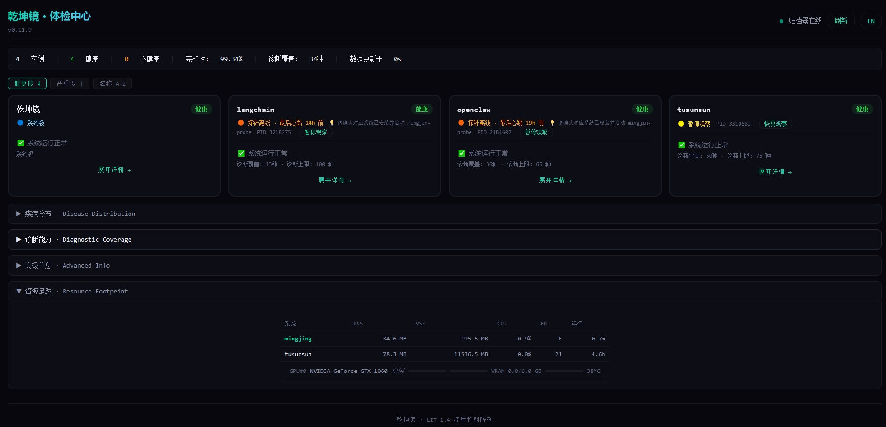

# 05 API Specification

> **Read-only external**: Query modules use read-only connections.

---

## I. CLI Commands

### 1.1 Common Commands

| Command | Description |
|---------|-------------|
| `ming report` | 4-level health report (critical/warning/sub-healthy/healthy) |
| `ming dx list` | List diagnosis records |
| `ming dx show <id>` | Show diagnosis details |
| `ming health` | Archiver health |
| `ming status` | System status |
| `ming self-check` | Self-check (probe/archiver/DB/disk) |
| `ming triage run` | Manually trigger triage |
| `ming web serve` | Start HTTP service (port 18088) |

### 1.2 Disease Operation Commands

| Command | Description |
|---------|-------------|
| `ming ignore <fault_id> -s <system>` | Ignore a diagnosis for a system |
| `ming archive-disease <fault_id> -s <system>` | Permanently archive (exclude from health) |
| `ming restore <fault_id> -s <system>` | Cancel ignore/archive |
| `ming reset <system>` | Force mark system as healthy |
| `ming reset-status` | View reset status |
| `ming instance-list` | List all registered instances |
| `ming probe list` | List all registered probes |
| `ming probe uninstall <system>` | Safely uninstall a probe |

### 1.3 Operations Commands

| Command | Description |
|---------|-------------|
| `ming config` | Show current configuration |
| `ming archive list` | List cold rail files |
| `ming archive verify` | Verify evidence chain |
| `ming skill list` | List installed plugins |
| `ming query <sql>` | Raw SQL query |
| `ming admin forget --session-id X` | Delete session data |
| `ming admin vacuum` | VACUUM database |
| `ming admin cleanup` | Clean up system data |

---

## II. Web Dashboard API

### 2.1 Core Endpoints

| Endpoint | Description |
|----------|-------------|
| `GET /api/data.json` | Full data.json (27 top-level fields) |
| `GET /api/events?limit=N&since=T&system=X` | Latest N events |
| `GET /api/models` | All distinct model list |
| `GET /api/config` | Archiver configuration (read-only) |
| `GET /api/version` | Frontend version |

### 2.2 Unified Query API (v0.11.10)

`GET /api/query?name=X&params=...`

| Query Name | Description |
|------------|-------------|
| `token-breakdown` | Token consumption breakdown (by model/hour/agent) |
| `tool-dangerous` | Dangerous tool call audit |
| `step-sequence` | Step sequence replay |
| `step-loop` | Step loop detection |
| `memory-retrieve` | Memory retrieval records |
| `agent-status` | Agent online status |
| `event-timeline` | Event timeline |

### 2.3 Shortcut Endpoints

| Endpoint | Equivalent To |
|----------|---------------|
| `GET /api/token/breakdown` | `/api/query?name=token-breakdown` |
| `GET /api/tool/audit` | `/api/query?name=tool-dangerous` |
| `GET /api/agent/status` | `/api/query?name=agent-status` |

### 2.4 Health Check Endpoints

| Endpoint | Description |
|----------|-------------|
| `GET /ming/health` | Self-check (heartbeat/memory/archive lag/capacity) |
| `GET /ming/diagnoses?system=X` | System diagnosis list |
| `GET /ming/coverage?system=X` | Triage coverage |
| `GET /ming/tokens?system=X` | Token usage/latency/frequency |
| `GET /ming/integrity?system=X` | Hash chain integrity |
| `POST /ming/push` | P0 diagnosis push receiver (requires X-Ming-Token) |

---

## III. data.json Field Structure

| Field | Description |
|-------|-------------|
| `systems` | System name list |
| `recent_events` | Last 200 events |
| `diagnoses` | Diagnosis records |
| `health` | Probe health metrics |
| `token_by_system` | Token consumption (by system) |
| `token_by_model` | Token consumption (by model) |
| `latency_stats` | Latency distribution (P50/P95/P99) |
| `integrity_stats` | Hash chain integrity |
| `capacity` | Capacity metrics (db_size/hot_files) |
| `triage` | Dynamic triage coverage |
| `self_health` | Bootstrap health metrics |
| `alerts` | Alert list |
| `instance_cards` | Instance card data |

---

## IV. Plugin Contract

### 4.1 Plugin Registration

Defined via `~/.ming/plugins/*/*.skill.yaml` file:

| Field | Description |
|-------|-------------|
| `name` | Plugin name |
| `version` | Version number |
| `type` | diagnostic/frontend/cron |
| `install.entrypoint` | Entry script |

### 4.2 Registered Plugins

| Plugin | Type | Contract |
|--------|------|----------|
| lit_lite | diagnostic | Input: SQLite read-only; Output: JSONL; Isolation: subprocess 60s timeout |
| web_dashboard | frontend | HTTP service + data.json export |
| tusunsun | cron | Tusunsun-specific diagnostic rules |

### 4.3 Plugin Execution

`plugin_runner.py` scans YAML files, executes via `subprocess.run(timeout=60)` subprocess isolation.

> **Plugin crash does not affect the baseplane.**

---

## V. Frontend Features (v0.11.10)



| Feature | Description |
|---------|-------------|
| Event stream | Virtual scrolling (100K+ events), time/system/type/model filtering |
| Token consumption | By system/model aggregation |
| Latency distribution | P50/P95/P99 statistics |
| Diagnosis medical record | Card-style diagnosis (expandable evidence chain) |
| OTEL Nexus | Receiver/Exporter/Channel Mix status |
| Triage coverage | Dynamic triage coverage (P0-P2), per-instance card display |
| Self-Health | Bootstrap health metrics panel |
| Toast notifications | Real-time alert notifications |
| Keyboard shortcuts | R refresh / / search / ↑↓ navigate |

---

## VI. CLI Query Commands

```bash
ming query token-breakdown --system hermes-agent --group-by model
ming query tool-audit --system tusunsun
ming query step-loop --system tusunsun --window 600
ming query agent-status
ming query event-timeline --system tusunsun --limit 200
```

---

**API philosophy: Three-layer decoupling, read-only external, plugin contract replaceable.**
